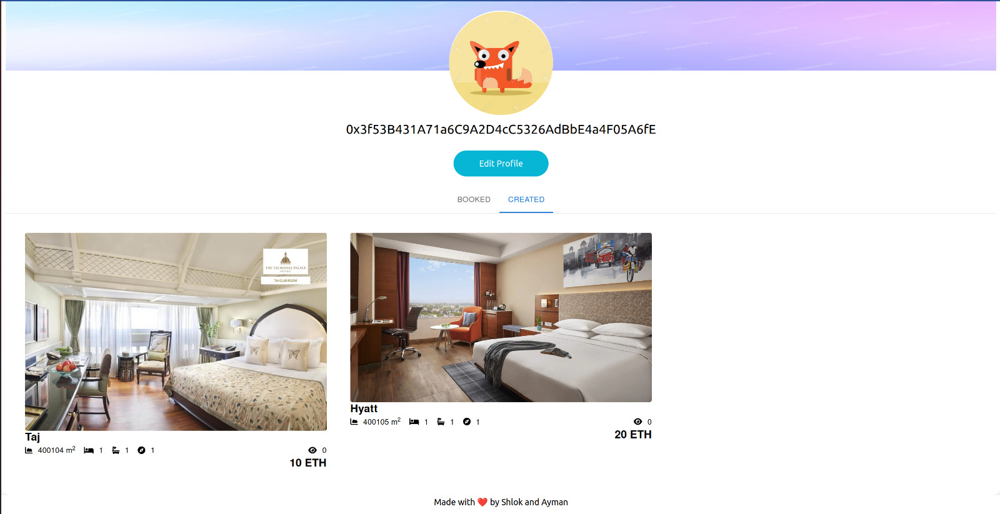
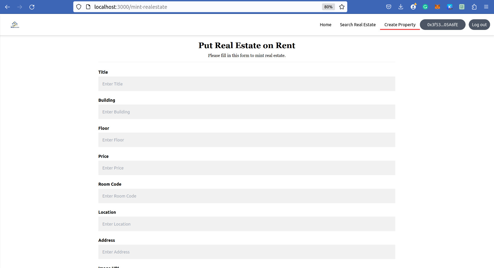
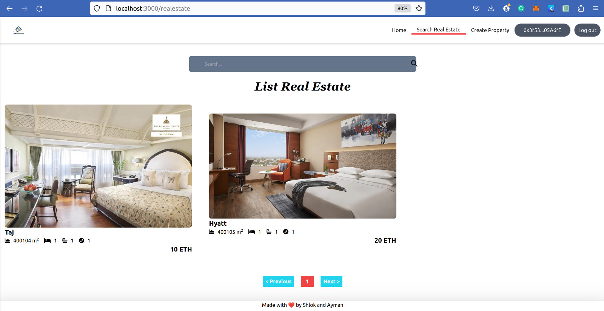

# Blockchain based Real-Estate Rental System

### This project was developed for IT465 - Cryptocurrency and Blockchain Technologies course at NITK. 
### You can find the Report and Presentation for this project above. 

# Contracts

You can find contract detail under `contracts/` directory:

# Tech Stack

**Client:** NextJs, TailwindCSS, Hardhat, MetaMask

**Server:** NodeJs, Mysql

**Blockchain:** Etherscan

# Installation

Install front-end:

```bash
  npm install
  npx hardhat compile
  npx hardhat run --network testnet scripts/deploy.js
  npm run dev
```

Install back-end: 

```bash
  npm install
  npm start
```

## Profile

<p align=center>

</p>

## Home

<p align=center>

</p>

## Rent and Search 

<p align=center>


</p>

# Authors

- [@shlokster](https://github.com/shlokster)

- [@ayman](https://github.com/Ayman161803)

# Support

For support, email bhosaleshlok@gmail.com.
